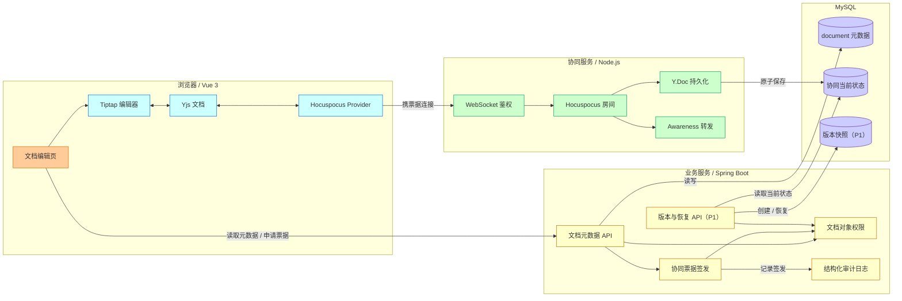
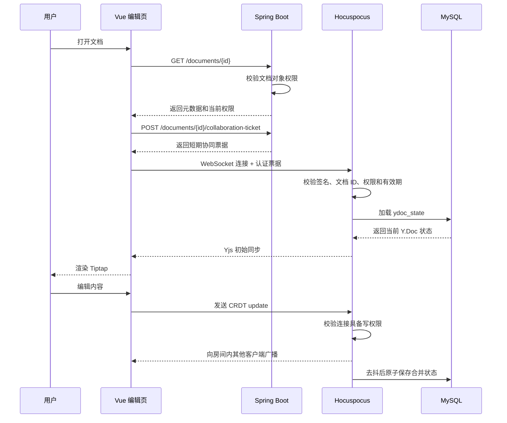

# 多人在线协同编辑技术可行性与落地方案

> 评审日期：2026-07-14
> 结论：方案可行，但原方案不能直接实施；需调整编辑器选型、数据库、鉴权、持久化和恢复设计。

## 1. 可行性结论

SkyLink 可以在现有 Vue 3 + Spring Boot + MySQL 架构上增加独立的 Node.js 协同服务，并使用 Yjs CRDT 完成多人实时编辑。Spring Boot 继续拥有文档元数据和权限，Hocuspocus 只负责实时协同会话与 Y.Doc 状态，职责边界清晰。

原方案存在以下关键不足，本文已作修正：

| 原方案问题 | 影响 | 修正结论 |
| --- | --- | --- |
| Vue 3 直接使用 BlockNote | 截至评审日，npm 不存在 `@blocknote/vue`；BlockNote 的主流集成面向 React | 改用 `Tiptap Vue 3 + Yjs + Hocuspocus`。若必须使用 BlockNote，需引入 React 子应用，不建议 |
| 架构图使用 PostgreSQL | 与当前项目 MySQL 配置、schema 和模型文档不一致 | 沿用 MySQL，Y.Doc 使用 `LONGBLOB` 保存 |
| 只在 Spring Boot 的 REST 请求中校验权限 | 用户可绕过 REST，直接连接协同 WebSocket | 由 Spring Boot 签发短期、文档级协同票据，Hocuspocus 在握手时强制验证 |
| 未定义只读用户的服务端限制 | 前端禁用编辑不能阻止恶意客户端发送更新 | Hocuspocus 必须根据票据权限拒绝只读连接提交的 Yjs update |
| 仅描述“保存 Y.Doc” | 未定义表结构、保存频率、原子性、崩溃恢复和版本策略 | 增加协同状态表、去抖持久化、版本快照和恢复规则 |
| Spring Boot 与 Hocuspocus 都可能写正文 | 容易形成两个正文真相源并互相覆盖 | 启用协同后，Y.Doc 是正文唯一真相源；`document.content` 只作为派生兼容快照 |
| 未覆盖断线、撤权、服务重启和多实例 | 实际运行时可能丢状态或越权 | 增加重连、周期复核、故障降级和扩容边界 |
| 并发示例暗示固定得到 `HelloWorld` | CRDT 保证最终一致，不保证符合人的语义顺序 | 验收应检查各端最终状态一致，而不是固定文本顺序 |

### 1.1 最小充分方案

P0 采用单实例 Hocuspocus。它已经能闭环解决两人同时编辑、光标显示、自动保存、断线重连和权限隔离，无需一开始引入 Redis、Kafka 或复杂分布式锁。Redis 只在协同服务需要多实例时进入 P1。

### 1.2 本期范围

- 富文本块编辑、多人实时同步、在线用户与光标。
- `read`、`edit`、`manage` 文档对象权限的协同侧执行。
- 自动保存、服务重启恢复和 Markdown 兼容快照。
- 短暂断网后的本地继续编辑和重连合并。

本期不包含评论、修订模式、历史版本恢复、逐字操作历史、离线数天后的无限期同步、跨文档引用和大规模多实例部署。

## 2. 与现有仓库的适配情况

| 现状 | 适配判断 |
| --- | --- |
| 前端为 Vue 3 + Vite | Tiptap 提供正式 Vue 3 集成，可直接接入 |
| 后端已有 JWT、用户、群组和文档权限模型 | 可复用，但必须新增文档级协同票据接口 |
| 数据库为 MySQL | 可存储 Y.Doc 二进制状态；不应在该方案中另引 PostgreSQL |
| `document` 表已有 `title`、`content`、`creator_id`、`status` | 保留为元数据表；协同二进制状态应放独立表 |
| 当前页面以普通 textarea 编辑正文 | 需要新增独立编辑页，避免在抽屉中承载长连接和复杂编辑状态 |
| 当前 `document.content` 是普通文本/Markdown | 首次进入协同时执行一次性导入，之后只作为派生快照使用 |

实现协同数据表时，必须同时更新 `docs/spec-current.md`、`docs/model.md`、`docs/backend/sql.md` 和 `backend/land/src/main/resources/schema.sql`，避免模型与实际 schema 分叉。

## 3. 技术选型

| 层次 | 选型 | 职责 |
| --- | --- | --- |
| 编辑器 | Tiptap Vue 3 | 富文本编辑与 Vue 组件集成 |
| 客户端协同模型 | Yjs | CRDT 文档、离线更新和最终一致合并 |
| WebSocket 客户端 | `@hocuspocus/provider` | 连接、重连、同步和 Awareness 传输 |
| 协同服务 | `@hocuspocus/server` | 房间管理、认证、更新广播和持久化钩子 |
| 业务服务 | Spring Boot | 文档元数据、对象权限、协同票据和授权复核 |
| 持久化 | MySQL | 文档元数据、Y.Doc 当前状态和 Markdown 派生快照 |
| 多实例协调（P1） | Redis | 跨实例同步、Presence 转发和节点协调 |

评审时从 npm 核对到 `@tiptap/vue-3`、`@hocuspocus/provider` 和 `@hocuspocus/server` 均有可用版本，而 `@blocknote/vue` 返回 404。实际开发应在技术验证分支中锁定同一代兼容版本，不直接使用浮动版本。

## 4. 系统边界与数据所有权



图示速读：

- Spring Boot 是文档身份、元数据和权限的唯一真相源。
- Hocuspocus 不自行推断业务权限，只接受 Spring Boot 签发的文档级票据。
- Hocuspocus 拥有实时 Y.Doc 当前状态；Presence 只转发、不落库。
- 启用协同后，REST 更新接口不得再直接覆盖正文。

| 数据 | 唯一写入方 | 真相源 | 说明 |
| --- | --- | --- | --- |
| 标题、状态、创建者、授权关系 | Spring Boot | `document` 及权限表 | 继续通过 REST 管理 |
| 正文协同状态 | Hocuspocus 持久化层 | `document_collaboration_state.ydoc_state` | 禁止 REST 直接写二进制状态 |
| 兼容正文快照 | 后台派生任务 | `document.content` | 用于旧接口、列表摘要或搜索，不参与合并 |
| 在线用户、光标、选区 | 客户端 Awareness | 内存 | 断线即失效，不写数据库 |
| 历史版本（P1） | Spring Boot 版本服务 | `document_version` | MVP 不建表、不提供版本 API |

## 5. 鉴权与权限闭环

### 5.1 协同票据

前端不能仅把现有 JWT 直接放入 WebSocket URL。URL 可能进入代理日志、浏览器历史或监控记录。推荐流程如下：

1. 前端携带现有访问令牌调用 `POST /api/v1/documents/{id}/collaboration-ticket`。
2. Spring Boot 检查用户状态、文档是否有效以及最终对象权限。
3. Spring Boot 返回一次短期票据，至少包含 `sub`、`documentId`、`permission`、`jti`、`aud`、`iat`、`exp`。
4. Provider 通过认证消息传递票据，不把票据拼入 URL。
5. Hocuspocus 校验签名、受众、有效期和 `documentId` 是否与房间名一致。
6. 服务端把权限写入连接上下文；`read` 连接只能接收同步，`edit/manage` 才能提交更新。

票据只用于建立协同连接，建议 60 秒内有效。Hocuspocus 不能仅信任客户端声明的用户 ID、用户名、颜色或权限。

### 5.2 撤权和用户禁用

仅在握手时验证会导致已连接用户在撤权后继续编辑。P0 采用以下规则：

- 每次重连必须重新申请票据。
- Hocuspocus 每 60 秒调用受服务凭证保护的内部权限检查，或使用等价的服务端复核机制。
- 权限降为 `read` 后立即拒绝后续 update；权限被移除、用户被禁用或文档被删除后关闭连接。
- P1 可通过权限变更事件主动断开对应用户或文档房间，缩短撤权窗口。

### 5.3 权限矩阵

| 身份 | 读取元数据 | 接收正文更新 | 提交正文更新 | 管理权限 | 创建/恢复版本 | 无权限表现 |
| --- | --- | --- | --- | --- | --- | --- |
| `read` | 是 | 是 | 否 | 否 | 否 | 编辑器只读；服务端拒绝伪造 update |
| `edit` | 是 | 是 | 是 | 否 | 可创建手动版本，不可恢复 | 管理入口不可见 |
| `manage`/创建者 | 是 | 是 | 是 | 是 | 是 | 高风险恢复需二次确认 |
| 无授权 | 否 | 否 | 否 | 否 | 否 | REST 返回 403/404；WebSocket 握手失败且不泄露标题 |

## 6. 打开、编辑与同步流程



图示速读：

- REST 先确认业务权限，再签发只对一个文档有效的协同票据。
- 初始正文只从 Y.Doc 状态加载，Spring Boot 不把 `document.content` 当作实时正文返回。
- 每个写入 update 都受服务端连接权限约束。
- 保存与键盘输入解耦，采用去抖持久化，不为每个按键执行一次 SQL。

## 7. CRDT 并发与离线规则

Yjs 的保证是：所有客户端收到相同更新集合后，最终得到相同文档状态。它不保证两个用户在同一位置输入时，结果一定符合某个自然语言顺序。因此测试应比较各端编码后的 Y.Doc 状态或渲染结果是否一致，而不是断言固定得到 `HelloWorld`。

断线规则：

- 短暂断网时，Yjs 在本地保留尚未同步的更新，界面显示“离线编辑中”。
- 重连前重新获取票据；若仍有编辑权限，则通过状态向量交换缺失更新并自动合并。
- 若断线期间权限被撤销，本地内容不得上传；界面提示复制个人改动后退出，不能伪装为“已保存”。
- 页面离开前若仍有未确认同步更新，显示明确提示；不能依赖 `beforeunload` 完成服务端保存。
- Awareness 与正文分离。光标、选区、用户名、颜色和在线状态不进入版本与数据库。

## 8. 持久化与版本预留

### 8.1 建议数据结构

这里只定义实施所需字段，真正建表时仍需同步项目模型和 SQL 文档。

| 表 | 关键字段 | 约束与用途 |
| --- | --- | --- |
| `document_collaboration_state` | `document_id BIGINT`、`ydoc_state LONGBLOB`、`state_vector LONGBLOB`、`revision BIGINT`、`update_time` | `document_id` 为主键和外键；保存当前合并状态；`revision` 单调递增 |
| `document_version`（P1） | `version_id BIGINT`、`document_id BIGINT`、`revision BIGINT`、`snapshot LONGBLOB`、`created_by`、`created_at`、`reason` | MVP 不创建；后续保存人工或周期版本 |

历史版本进入 P1 后，如快照增长过快，可迁到对象存储，并在 `document_version` 保存 `storage_key` 和校验和。

### 8.2 保存规则

- Hocuspocus 在首次加载房间时读取完整 Y.Doc 状态；不存在时才从旧 `document.content` 一次性初始化。
- 收到更新后在内存合并，建议 1～2 秒去抖后保存当前编码状态。
- 保存使用单条原子 UPSERT，并以 `revision` 或等价乐观锁防止旧状态覆盖新状态。
- 服务停止钩子可尝试刷新脏文档，但正确性不能只依赖优雅停机。
- 同一文档的持久化任务必须串行；失败后指数退避重试，并保留“未持久化”指标和告警。
- `document.content` 的派生快照可异步更新，但失败不得回写或覆盖 Y.Doc。

### 8.3 P1：版本和恢复

- 手动版本：用户主动命名或说明后创建。
- 周期版本：文档有变化时最多每 5 分钟创建一次，可在 P1 开启。
- 恢复版本不是覆盖历史记录，而是把目标快照应用为新的当前状态，并追加一条“由版本 X 恢复”的新版本。
- 恢复前显示版本时间、创建人和影响，并要求 `manage` 权限确认。
- 恢复成功后向房间内客户端广播新状态；禁止客户端继续提交基于恢复前权限或旧会话的写入。

## 9. 在线光标与 Presence

Presence 使用 Yjs Awareness 协议，只保存最小展示信息：稳定用户 ID、显示名、随机分配的会话颜色、光标和选区。不得放入 JWT、手机号、邮箱、角色全集或其他敏感资料。

- 同一用户多个标签页应使用不同 `clientId`，但 UI 可按用户合并展示。
- 连接异常断开后，服务端应在超时窗口内清理 Awareness 状态。
- 用户名和权限来自已验证的服务端上下文，不能直接信任客户端 payload。
- Presence 丢失不影响正文正确性，也不触发版本创建。

## 10. 故障、恢复与扩容

| 场景 | 系统行为 | 用户反馈/恢复 |
| --- | --- | --- |
| Spring Boot 暂时不可用 | 已建立连接可在权限复核宽限期内继续；新连接不能取得票据 | 显示“暂时无法加入协作”，允许重试 |
| Hocuspocus 断开 | Provider 自动重连，Yjs 保留本地更新 | 显示“正在重连”，成功后改为“已同步” |
| MySQL 短暂失败 | 房间内继续合并，持久化任务退避重试并告警 | 不显示“已保存”，显示“同步成功，服务器保存延迟” |
| 权限被撤销 | 服务端拒绝新 update 并关闭或降级连接 | 立即切换只读，未上传内容允许用户复制 |
| 文档逻辑删除/归档 | 拒绝新连接；现有连接在复核时关闭或只读 | 显示对象状态，不继续接受编辑 |
| 协同服务重启 | 从最新持久化 Y.Doc 恢复；客户端重连补交未同步 update | 自动恢复并重新显示同步状态 |
| 单个 update 或文档超限 | 服务端拒绝并记录指标，不能拖垮进程 | 提示内容过大或格式不支持 |

P0 只部署一个 Hocuspocus 实例。仅共享 MySQL 不能安全支持多实例实时房间，因为不同节点的内存状态和 Awareness 不会自动互通。P1 扩容时必须增加 Redis 等跨实例同步机制，并完成节点故障、消息乱序和重复消息测试后才能开启多副本。

## 11. 安全与运维要求

- WebSocket 生产环境使用 WSS，并限制允许的 Origin。
- 限制连接数、单用户连接数、房间人数、单条消息大小和文档最大编码大小。
- 票据使用独立密钥或非对称签名，不复用前端可见配置；密钥支持轮换。
- 内部权限复核接口只允许协同服务访问，并使用服务身份认证。
- 日志只记录用户 ID、文档 ID、事件类型、结果、耗时和错误码，不记录票据、JWT、完整正文或 Yjs 二进制内容。
- 监控至少包含当前连接数、房间数、同步延迟、鉴权失败数、持久化失败数、脏文档数、文档加载耗时和进程内存。
- 对 update 解码、超大文档、异常客户端和快速重连执行资源保护，避免内存或 CPU 被单个连接耗尽。

## 12. 前端交互状态

编辑页至少展示以下状态，不能把“已连接”和“已持久化”混为一件事：

| 状态 | 含义 | 可编辑性 |
| --- | --- | --- |
| 正在连接 | 正在获取票据或建立 WebSocket | 暂缓编辑或显示骨架屏 |
| 已同步 | 已与房间完成 Yjs 同步 | 按权限决定 |
| 保存中 | 服务端已同步更新，持久化尚未确认 | 可继续编辑 |
| 已保存 | 最新已知 revision 已持久化 | 可继续编辑 |
| 离线编辑中 | 本地有未同步更新 | 有原编辑权限时可继续，本地明确标记 |
| 只读 | 用户只有 `read`、文档归档或权限已降级 | 不可编辑，可复制 |
| 同步失败 | 重连或持久化持续失败 | 保留本地内容，提供重试和复制出口 |

## 13. 分阶段实施

| 阶段 | 工作内容 | 完成条件 |
| --- | --- | --- |
| P0-验证 | 单独验证 Tiptap Vue 3、Yjs 和 Hocuspocus；两浏览器并发编辑与重连 | 两端最终一致；依赖版本锁定；无 BlockNote/React 依赖 |
| P0-鉴权 | 新增协同票据、Hocuspocus 鉴权、读写权限和 Origin/限流 | 直接伪造连接、跨文档复用票据、只读提交 update 均失败 |
| P0-持久化 | 新增协同状态表、加载/保存、旧正文一次性迁移、重启恢复 | 服务重启后正文一致；旧 API 不会覆盖 Y.Doc |
| P0-体验 | 独立编辑页、Presence、同步状态、断线重连 | 用户能区分连接、同步、保存、离线和只读状态 |
| P1-版本 | 手动版本、列表、预览和恢复 | MVP 验收后另行实施；恢复产生新版本且所有在线端最终一致 |
| P1-扩容 | Redis 跨实例同步、主动撤权事件、历史快照对象存储 | 多实例压测、故障切换和权限事件测试通过 |

## 14. 验收标准

| 编号 | 场景 | 预期结果 |
| --- | --- | --- |
| AC-01 | 两名编辑者同时在不同位置输入 | 两端无需刷新即可看到更新，停止编辑后最终内容一致 |
| AC-02 | 两名编辑者在同一位置并发输入 | 不丢失任一已接受更新，各端最终状态一致；不要求固定语义顺序 |
| AC-03 | 编辑者断网后继续输入并重连 | 权限未变时自动补交并合并更新，不覆盖其他人的内容 |
| AC-04 | 只读用户使用篡改客户端发送 update | 服务端拒绝，其他客户端和数据库状态不变化 |
| AC-05 | 用户用文档 A 的票据连接文档 B | WebSocket 认证失败且不泄露文档 B 信息 |
| AC-06 | 在线编辑期间撤销权限或禁用用户 | 最迟在复核窗口内停止写入；之后的 update 不落库、不广播 |
| AC-07 | Hocuspocus 正常重启 | 从持久化状态恢复，客户端重连后内容一致 |
| AC-08 | MySQL 短暂不可用后恢复 | 不产生旧快照覆盖新快照；重试成功后状态持久化 |
| AC-09（P1） | 从历史版本恢复 | 不进入 MVP 验收；后续仅 `manage` 可执行 |
| AC-10 | Presence 更新 | 光标和在线状态可见，但数据库、版本和日志中无 Presence 内容 |
| AC-11 | 检查应用日志 | 不包含 JWT、协同票据、正文和 Y.Doc 二进制 |
| AC-12 | 性能基线 | 单文档 20 人、单实例 100 个在线连接下完成压测；局域网/正常网络的更新传播 P95 目标小于 300 ms，具体容量以压测结果为准 |

## 15. 最终建议

推荐采用：

```text
Vue 3 + Tiptap + Yjs
          │
          ▼
Hocuspocus Provider
          │ WebSocket + 文档级短期票据
          ▼
Hocuspocus Server（P0 单实例）
          │
          ▼
MySQL：Y.Doc 当前状态 + Markdown 派生快照

Spring Boot：文档元数据 + 权限真相源 + 票据 + 授权复核
```

该路线保留原方案“Spring Boot 不参与实时 CRDT 广播”的优点，同时补齐了 Vue 兼容性、对象权限、单一真相源、可靠保存和故障恢复。完成 P0 技术验证后再进入正式数据表和页面实现，风险最低。
