# SkyLink 团队协作办公平台数据模型设计

## 1. 设计原则

SkyLink 面向企业团队、校园组织及项目团队，覆盖用户管理、组织架构、即时通讯、任务协作、在线文档、文件管理、日程安排、公告通知、系统日志与基础配置等核心场景。数据库采用 MySQL 关系模型设计，并遵循以下原则：

1. 满足第三范式（3NF），降低冗余并保证数据一致性。
2. 主业务实体使用代理主键，统一采用 `BIGINT`。
3. 多对多关联表优先使用复合主键，而不是额外增加自增 ID。
4. 配置型实体保留稳定业务编码，如 `role_code`、`permission_code`、`config_key`。
5. 业务数据优先逻辑删除，审计日志优先保留历史，不依赖级联物理删除。
6. 枚举状态尽量使用数值码值，减少自由文本带来的维护成本。
7. `spec.md` 中出现的功能点尽量都有对应的数据承载表或明确说明由现有表承接。

---

## 2. 数据库总体结构

SkyLink 数据库共设计 **29 张核心数据表**：

```text
SkyLink Database
│
├── 用户与权限模块
│   ├── 用户(User)
│   ├── 角色(Role)
│   ├── 权限(Permission)
│   ├── 用户角色(UserRole)
│   └── 角色权限(RolePermission)
│
├── 组织架构模块
│   └── 部门(Department)
│
├── 即时通讯模块
│   ├── 好友申请(FriendRequest)
│   ├── 好友关系(Friendship)
│   ├── 群聊(ChatGroup)
│   ├── 群成员(GroupMember)
│   └── 消息(Message)
│
├── 文件管理模块
│   ├── 文件(SysFile)
│   ├── 文件共享(FileShare)
│   ├── 文件收藏(FileFavorite)
│   └── 文件日志(FileLog)
│
├── 在线文档模块
│   ├── 文档(Document)
│   ├── 文档权限(DocumentPermission)
│   ├── 文档群组权限(DocumentGroupPermission)
│   └── 文档收藏(DocumentFavorite)
│
├── 任务协作模块
│   ├── 任务(Task)
│   └── 任务附件(TaskAttachment)
│
├── 日程模块
│   └── 日程(Schedule)
│
├── 公告通知模块
│   ├── 公告通知(Notice)
│   ├── 公告投放部门(NoticeDepartment)
│   └── 公告已读(NoticeRead)
│
└── 系统管理模块
    ├── 登录日志(LoginLog)
    ├── 操作日志(OperationLog)
    ├── 删除日志(DeleteLog)
    └── 系统配置(SystemConfig)
```

---

## 3. 主键设计规范

### 3.1 适合使用自增主键的表

以下表属于主业务实体，使用 `BIGINT AUTO_INCREMENT` 作为代理主键是合理的：

- `user`
- `department`
- `role`
- `permission`
- `friend_request`
- `chat_group`
- `message`
- `sys_file`
- `file_share`
- `file_log`
- `document`
- `task`
- `task_attachment`
- `schedule`
- `notice`
- `login_log`
- `operation_log`
- `delete_log`
- `system_config`

这些表的数据记录本身具有独立生命周期，使用单列主键更方便被外部表引用。

### 3.2 不适合使用自增主键的表

以下表更适合使用复合主键或业务主键：

1. `user_role`
   主键为 `(user_id, role_id)`，表示某用户拥有某角色。

2. `role_permission`
   主键为 `(role_id, permission_id)`，表示某角色拥有某权限。

3. `group_member`
   主键为 `(group_id, user_id)`，表示某用户加入某群。

4. `document_permission`
   主键为 `(document_id, user_id)`，表示某用户拥有某文档权限。

5. `document_group_permission`
   主键为 `(document_id, group_id)`，表示某群组拥有某文档权限。

6. `friendship`
   好友关系属于对称关系，主键应为 `(user_id, friend_user_id)`，并约束 `user_id < friend_user_id`，避免 A-B 与 B-A 重复。

7. `file_favorite`
   主键为 `(user_id, file_id)`，表示某用户收藏某文件。

8. `document_favorite`
   主键为 `(user_id, document_id)`，表示某用户收藏某文档。

9. `notice_department`
   主键为 `(notice_id, department_id)`，表示某公告投放到某部门。

10. `notice_read`
   主键为 `(notice_id, user_id)`，表示某用户已读某公告，用于支撑未读数量统计。

---

## 4. 核心实体说明

### 4.1 用户（User）

用户是系统核心实体，一个用户可以：

- 属于一个部门
- 拥有多个角色
- 添加多个好友
- 创建多个群聊
- 加入多个群聊
- 创建多个任务
- 接收多个任务
- 创建多个文档
- 上传多个文件
- 收藏文件和文档
- 创建多个日程
- 查看公告与通知

主要字段：

| 字段 | 类型 | 说明 |
| --- | --- | --- |
| user_id | BIGINT | 用户ID |
| username | VARCHAR(50) | 用户名，唯一 |
| password | VARCHAR(255) | 密码哈希 |
| email | VARCHAR(100) | 邮箱，唯一 |
| phone | VARCHAR(20) | 手机号，唯一 |
| nickname | VARCHAR(50) | 昵称 |
| avatar | VARCHAR(255) | 头像 |
| status | TINYINT | 状态码 |
| department_id | BIGINT | 所属部门 |

对应 SQL 设计说明：

- `username`、`email`、`phone` 都设置唯一约束，分别承接用户名登录、邮箱登录和注册防重。
- `department_id` 关联 `department.department_id`，用于通讯录、部门统计和组织管理。
- `status` 用于控制账号启用与禁用，便于管理员停用成员账号。
- `is_deleted` 用于逻辑删除，避免直接物理删除用户后影响历史业务数据。

### 4.2 部门（Department）

用于组织团队结构，一个部门可包含多个用户，并可指定一个负责人。

对应 SQL 设计说明：

- `department_name` 设置唯一约束，避免出现同名部门。
- `leader_id` 关联 `user.user_id`，表示部门负责人。
- 部门与用户是一对多关系，部门人数统计可直接基于 `user.department_id` 聚合。
- `description` 用于存储部门职责、介绍等扩展说明。

### 4.3 角色（Role）与权限（Permission）

系统采用 RBAC 模型：

- 用户与角色：多对多
- 角色与权限：多对多

因此需要两张关联表：

- `user_role`
- `role_permission`

其中：

- `role_code` 应唯一，如 `ROLE_ADMIN`
- `permission_code` 应唯一，如 `user:add`

对应 SQL 设计说明：

- `role` 表保存角色元数据，`role_name` 用于显示，`role_code` 用于程序判断。
- `permission` 表保存权限点，`permission_type` 区分菜单、按钮、接口。
- `permission.parent_id` 用于构建树形权限结构，支持菜单层级。
- `permission.sort_no` 用于前端菜单展示排序。
- `user_role` 是用户和角色的中间表，复合主键防止重复授权。
- `role_permission` 是角色和权限的中间表，复合主键防止重复分配。

### 4.4 好友申请（FriendRequest）与好友关系（Friendship）

好友申请和已建立的好友关系分开保存：

- `friend_request` 保存申请人、接收人、申请附言和处理状态
- `friendship` 只保存已经建立的对称好友关系
- 好友关系存储时统一按用户 ID 排序，同一对用户仅允许一条记录

对应 SQL 设计说明：

- `friend_request.request_id` 是好友申请的独立主键，供申请处理接口使用。
- `friend_request.message` 保存申请附言，`status` 表示待处理、已同意或已拒绝。
- 好友申请允许保留历史记录；业务层需保证同一对用户同时最多存在一条待处理申请。
- `friendship` 使用 `(user_id, friend_user_id)` 作为复合主键，不再额外引入自增 ID。
- `CHECK (user_id < friend_user_id)` 用来避免同一好友关系被存成两条方向相反的数据。
- 好友申请被同意后，由业务事务更新申请状态并创建 `friendship` 记录。

### 4.5 群聊（ChatGroup）与群成员（GroupMember）

群聊和成员是典型的一对多与多对多混合场景：

- 一个群聊拥有多个成员
- 一个用户可加入多个群聊
- `group_member` 使用复合主键 `(group_id, user_id)`
- 群管理员和群主通过 `member_role` 标识

对应 SQL 设计说明：

- `chat_group` 保存群本身的信息，包括 `group_name`、`avatar`、`notice`、`owner_id`。
- `owner_id` 指向群主，是群级权限的最高拥有者。
- `group_member.member_role` 用数值区分群主、管理员、普通成员，便于权限判断。
- `group_member` 的复合主键确保一个用户在同一个群里只有一条成员记录。
- 邀请成员、踢出成员、本质上都是对 `group_member` 表的增删改。

### 4.6 消息（Message）

消息支持单聊和群聊，并承接文本、图片、文件、Emoji、系统消息等场景。数据库层应保证：

- 单聊时 `receiver_id` 非空、`group_id` 为空
- 群聊时 `group_id` 非空、`receiver_id` 为空

对应 SQL 设计说明：

- `message_type` 区分文本、图片、文件、系统消息、Emoji。
- `content` 统一存消息正文或资源路径，简化消息表结构。
- `sender_id` 在系统消息场景下可为空。
- `is_recalled` 用于支持消息撤回，而不是直接物理删除消息。
- `CHECK` 约束保证一条消息只能属于单聊或群聊其中一种场景。

### 4.7 文件（SysFile）相关表

文件模块由以下几类表组成：

- `sys_file`：保存上传元数据
- `file_share`：保存共享授权
- `file_favorite`：保存收藏关系
- `file_log`：记录上传、下载、分享、删除等操作

其中 `file_share` 的目标应满足二选一约束：

- 分享给个人：`target_user_id` 非空
- 分享给群聊：`target_group_id` 非空

对应 SQL 设计说明：

- `sys_file` 是文件主表，保存文件名、存储路径、大小、扩展名、MIME 类型、上传者等信息。
- `storage_type` 预留本地存储或对象存储的扩展能力。
- `file_share` 保存共享记录，`permission_type` 区分查看和编辑权限。
- `file_share` 的两个唯一约束防止同一文件重复共享给同一用户或同一群。
- `file_favorite` 是用户和文件的收藏关系表，使用复合主键避免重复收藏。
- `file_log` 记录上传、下载、分享、删除、收藏等动作，用于审计和后台日志查看。

### 4.8 在线文档（Document）相关表

文档模块由以下表组成：

- `document`：文档主体
- `document_permission`：用户协作权限
- `document_group_permission`：群组协作权限
- `document_favorite`：文档收藏

这对应 `spec.md` 中的文档创建、编辑、共享、收藏需求。

对应 SQL 设计说明：

- `document.title` 和 `document.content` 分别存标题和正文，正文可保存 Markdown 或富文本 JSON。
- `document.status` 区分私有、团队共享、归档状态。
- `document_permission` 用于控制单个协作者对文档的只读、评论、编辑、管理权限。
- `document_permission` 的复合主键防止同一用户对同一文档出现重复授权。
- `document_group_permission` 用于将文档授权给群组，群成员通过群组关系获得相应权限。
- `document_group_permission` 使用 `(document_id, group_id)` 复合主键，保证同一文档对同一群组只有一条授权。
- `document_favorite` 承接文档收藏需求，便于个人中心快速访问常用文档。

### 4.9 任务（Task）与任务附件（TaskAttachment）

根据需求，任务不仅有标题、负责人、截止时间，还包括：

- 开始时间
- 优先级
- 备注
- 附件

因此：

- `task` 存任务主体信息
- `task_attachment` 存任务附件关系

对应 SQL 设计说明：

- `task.creator_id` 表示任务创建人，`executor_id` 表示执行人。
- `priority` 用数值区分低、中、高优先级。
- `status` 用数值表示未开始、进行中、已完成、已取消。
- `progress_rate` 用于支撑进度统计和看板展示。
- `start_time` 与 `deadline` 一起描述任务周期。
- `remark` 用于存放补充说明、注意事项等文本。
- `task_attachment` 通过关联 `sys_file` 支持任务携带多个附件。

### 4.10 日程（Schedule）

为了对齐“重复提醒、全天事件、删除、修改”等需求，日程表除起止时间外，还应包含：

- `is_all_day`：是否全天事件
- `repeat_type`：重复类型
- `remind_time`：提醒时间

对应 SQL 设计说明：

- `schedule_type` 区分会议、学习、工作、提醒等不同日程类型。
- `is_all_day` 用于标识全天事件，方便日历视图渲染。
- `start_time` 和 `end_time` 是时间轴核心字段，并通过 `CHECK` 保证结束时间不早于开始时间。
- `repeat_type` 用于承接每天、每周、每月等重复规则。
- `user_id` 表示该日程归属哪个用户，适合个人日程场景。

### 4.11 公告通知（Notice）与已读记录（NoticeRead）

`spec.md` 中明确存在：

- 公告
- 通知
- 活动
- 未读数量

因此：

- `notice` 使用 `notice_type` 区分类型
- `notice_department` 保存公告与投放部门的关系
- `notice_read` 保存成员已读关系，用于统计未读数量

对应 SQL 设计说明：

- `notice` 主表保存公告、通知、活动三类内容。
- `publisher_id` 关联发布人，通常是管理员或超级管理员。
- `status` 支持草稿、已发布、已撤回三个阶段。
- `publish_time` 用于区分创建和正式发布的时间。
- `notice_department` 通过 `(notice_id, department_id)` 支持一条公告投放到多个部门。
- `notice_read` 通过 `(notice_id, user_id)` 标记某个用户是否已读某条公告。
- 未读数量统计时，先按当前用户所属部门筛选公告，再排除 `notice_read` 中已有的记录。

### 4.12 日志与系统配置

根据需求，系统管理模块除登录日志、操作日志外，还需要：

- `file_log`：文件操作日志
- `delete_log`：删除行为日志
- `system_config`：系统配置键值

这样才能覆盖 `spec.md` 中的日志管理与系统配置需求。

对应 SQL 设计说明：

- `login_log` 记录登录结果、IP、设备、浏览器等信息，用于安全审计。
- `operation_log` 记录模块、操作描述、请求路径、请求方法，用于追踪关键业务动作。
- `delete_log` 单独记录删除行为，突出高风险操作，便于审计和追责。
- `file_log` 聚焦文件相关动作，和通用操作日志分工明确。
- `system_config` 使用 `config_key` / `config_value` 方式保存系统配置，适合开关项、默认值、展示文案等轻量配置。
- 日志表普遍不做逻辑删除，也不强依赖业务表级联删除，以保证历史可追溯。

---

## 5. 主要关系说明

```mermaid
erDiagram
    DEPARTMENT ||--o{ USER : contains
    USER ||--o{ USER_ROLE : has
    ROLE ||--o{ USER_ROLE : assigned_to
    ROLE ||--o{ ROLE_PERMISSION : owns
    PERMISSION ||--o{ ROLE_PERMISSION : granted_to

    USER ||--o{ FRIEND_REQUEST : requests
    USER ||--o{ FRIEND_REQUEST : receives
    USER ||--o{ FRIENDSHIP : user_side
    USER ||--o{ FRIENDSHIP : friend_side

    USER ||--o{ CHAT_GROUP : owns
    CHAT_GROUP ||--o{ GROUP_MEMBER : has
    USER ||--o{ GROUP_MEMBER : joins

    USER ||--o{ MESSAGE : sends
    USER o|--o{ MESSAGE : receives
    CHAT_GROUP o|--o{ MESSAGE : contains

    USER ||--o{ SYS_FILE : uploads
    SYS_FILE ||--o{ FILE_SHARE : shared_as
    USER o|--o{ FILE_SHARE : shared_to_user
    CHAT_GROUP o|--o{ FILE_SHARE : shared_to_group
    USER ||--o{ FILE_FAVORITE : favorites
    SYS_FILE ||--o{ FILE_FAVORITE : favorited_by
    USER o|--o{ FILE_LOG : operates
    SYS_FILE ||--o{ FILE_LOG : logs

    USER ||--o{ DOCUMENT : creates
    DOCUMENT ||--o{ DOCUMENT_PERMISSION : authorizes
    USER ||--o{ DOCUMENT_PERMISSION : receives
    DOCUMENT ||--o{ DOCUMENT_GROUP_PERMISSION : authorizes_group
    CHAT_GROUP ||--o{ DOCUMENT_GROUP_PERMISSION : receives
    USER ||--o{ DOCUMENT_FAVORITE : favorites
    DOCUMENT ||--o{ DOCUMENT_FAVORITE : favorited_by

    USER ||--o{ TASK : creates
    USER o|--o{ TASK : executes
    TASK ||--o{ TASK_ATTACHMENT : contains
    SYS_FILE ||--o{ TASK_ATTACHMENT : attached_as

    USER ||--o{ SCHEDULE : owns
    USER ||--o{ NOTICE : publishes
    NOTICE ||--o{ NOTICE_DEPARTMENT : targets
    DEPARTMENT ||--o{ NOTICE_DEPARTMENT : receives
    NOTICE ||--o{ NOTICE_READ : read_by
    USER ||--o{ NOTICE_READ : reads

    USER o|--o{ LOGIN_LOG : logs_in
    USER o|--o{ OPERATION_LOG : operates
    USER o|--o{ DELETE_LOG : deletes
```



---

## 6. 与 `spec.md` 的对齐说明

下列需求已明确映射到模型中：

1. **文件收藏**：新增 `file_favorite`
2. **文档收藏**：新增 `document_favorite`
3. **任务附件**：新增 `task_attachment`
4. **公告未读数量**：新增 `notice_read`
5. **文件日志**：新增 `file_log`
6. **删除日志**：新增 `delete_log`
7. **系统配置**：新增 `system_config`
8. **公告/通知/活动分类**：`notice.notice_type`
9. **全天事件**：`schedule.is_all_day`
10. **任务开始时间与备注**：`task.start_time`、`task.remark`
11. **好友申请附言**：新增 `friend_request`
12. **文档群组权限**：新增 `document_group_permission`
13. **公告按部门投放**：新增 `notice_department`

以下需求不单独建表，而由现有表或业务逻辑支撑：

- 用户登录 JWT：由认证服务生成，不依赖专门业务表
- 在线人数、消息数、文件数、任务完成率等统计：由业务数据聚合得到

---

## 7. 数据完整性约束

为保证数据一致性与可维护性，数据库应具备以下约束：

1. **主键约束**：每张表必须有主键；关联表使用复合主键。
2. **唯一约束**：用户名、邮箱、手机号、角色编码、权限编码、配置键必须唯一。
3. **外键约束**：核心引用关系使用外键保证数据有效性。
4. **非空约束**：用户名、密码、标题、创建人等关键字段不能为空。
5. **默认值约束**：创建时间、更新时间、状态等应提供合理默认值。
6. **检查约束**：消息目标、文件共享目标、好友用户排序、日程起止时间等应设置校验规则。
7. **索引优化**：对高频查询字段如用户名、状态、时间、负责人、所属部门建立索引。
8. **逻辑删除规范**：用户、部门、任务、文档、文件等业务表可逻辑删除；日志表以保留历史为主。

---

## 8. 规范总结

本次补全后的设计重点解决了以下问题：

1. 让模型和 `spec.md` 的功能范围保持一致。
2. 补齐了收藏、已读、附件、文件日志、删除日志、系统配置等缺失实体。
3. 保留了关联表不用自增主键的规范设计。
4. 让公告通知、任务、日程等字段更贴近实际需求。
5. 将“数据库需要承接的能力”和“由业务逻辑计算的能力”明确区分开了。

这套模型现在更适合作为课程设计文档、建表依据和后续接口实现基础。
