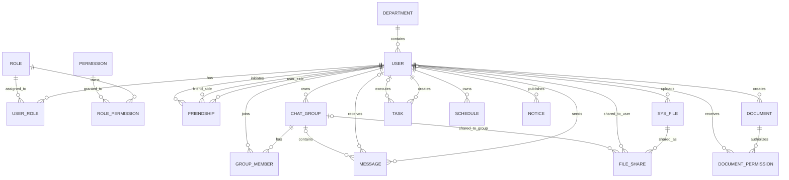

# SkyLink 团队协作办公平台数据模型设计

## 1. 设计原则

SkyLink 面向企业团队、校园组织及项目团队，覆盖用户管理、组织架构、即时通讯、任务协作、在线文档、文件管理、日程安排及通知公告等核心场景。数据库采用 MySQL 关系模型设计，并遵循以下原则：

1. 满足第三范式（3NF），降低冗余并保证数据一致性。
2. 主业务实体使用代理主键，统一采用 `BIGINT`。
3. 多对多关联表优先使用复合主键，而不是额外增加自增 ID。
4. 配置型实体保留稳定业务编码，如 `role_code`、`permission_code`。
5. 业务数据优先逻辑删除，审计日志优先保留历史，不依赖级联物理删除。
6. 枚举状态尽量使用数值码值，减少自由文本带来的维护成本。

---

## 2. 数据库总体结构

SkyLink 数据库共设计 **19 张核心数据表**：

```text
SkyLink Database
│
├── 用户与权限模块
│   ├── 用户(User)
│   ├── 角色(Role)
│   ├── 权限(Permission)
│   ├── 用户角色(UserRole)
│   └── 角色权限(RolePermission)
│
├── 组织架构模块
│   └── 部门(Department)
│
├── 即时通讯模块
│   ├── 好友关系(Friendship)
│   ├── 群聊(ChatGroup)
│   ├── 群成员(GroupMember)
│   └── 消息(Message)
│
├── 文件管理模块
│   ├── 文件(SysFile)
│   └── 文件共享(FileShare)
│
├── 在线文档模块
│   ├── 文档(Document)
│   └── 文档权限(DocumentPermission)
│
├── 任务协作模块
│   └── 任务(Task)
│
├── 日程模块
│   └── 日程(Schedule)
│
└── 系统管理模块
    ├── 公告(Notice)
    ├── 登录日志(LoginLog)
    └── 操作日志(OperationLog)
```

---

## 3. 主键设计规范

### 3.1 适合使用自增主键的表

以下表属于主业务实体，使用 `BIGINT AUTO_INCREMENT` 作为代理主键是合理的：

- `user`
- `department`
- `role`
- `permission`
- `chat_group`
- `message`
- `sys_file`
- `file_share`
- `document`
- `task`
- `schedule`
- `notice`
- `login_log`
- `operation_log`

这些表的数据记录本身具有独立生命周期，使用单列主键更方便被外部表引用。

### 3.2 不适合使用自增主键的表

以下表更适合使用复合主键或业务主键：

1. `user_role`
   主键应为 `(user_id, role_id)`，因为一条记录本质上就是“某用户拥有某角色”。

2. `role_permission`
   主键应为 `(role_id, permission_id)`，因为一条记录本质上就是“某角色拥有某权限”。

3. `group_member`
   主键应为 `(group_id, user_id)`，因为一条记录本质上就是“某用户加入某群”。

4. `document_permission`
   主键应为 `(document_id, user_id)`，因为一条记录本质上就是“某用户拥有某文档权限”。

5. `friendship`
   好友关系属于对称关系，不建议单独使用自增 ID。更规范的设计是使用 `(user_id, friend_user_id)` 作为主键，并约束 `user_id < friend_user_id`，避免出现 A-B 与 B-A 两条重复记录。

---

## 4. 核心实体说明

### 4.1 用户（User）

用户是系统核心实体，一个用户可以：

- 属于一个部门
- 拥有多个角色
- 添加多个好友
- 创建多个群聊
- 加入多个群聊
- 创建多个任务
- 接收多个任务
- 创建多个文档
- 上传多个文件
- 创建多个日程

主要字段：

| 字段 | 类型 | 说明 |
| --- | --- | --- |
| user_id | BIGINT | 用户ID |
| username | VARCHAR(50) | 用户名，唯一 |
| password | VARCHAR(255) | 密码哈希 |
| email | VARCHAR(100) | 邮箱，唯一 |
| phone | VARCHAR(20) | 手机号，唯一 |
| status | TINYINT | 状态码 |
| department_id | BIGINT | 所属部门 |

### 4.2 部门（Department）

用于组织团队结构，一个部门可包含多个用户，并可指定一个负责人。

### 4.3 角色（Role）与权限（Permission）

系统采用 RBAC 模型：

- 用户与角色：多对多
- 角色与权限：多对多

因此需要两张关联表：

- `user_role`
- `role_permission`

其中：

- `role_code` 应唯一，如 `ROLE_ADMIN`
- `permission_code` 应唯一，如 `user:add`

### 4.4 好友关系（Friendship）

好友关系是用户与用户之间的对称关系。为避免重复：

- 同一对用户仅允许一条记录
- 存储时统一按用户 ID 排序
- 使用 `initiator_id` 记录发起人

### 4.5 群聊（ChatGroup）与群成员（GroupMember）

群聊和成员是典型的一对多与多对多混合场景：

- 一个群聊拥有多个成员
- 一个用户可加入多个群聊
- `group_member` 使用复合主键 `(group_id, user_id)`

### 4.6 消息（Message）

消息同时支持单聊和群聊，因此数据库层应保证：

- 单聊时 `receiver_id` 非空、`group_id` 为空
- 群聊时 `group_id` 非空、`receiver_id` 为空

### 4.7 文件（SysFile）与文件共享（FileShare）

文件表保存上传元数据，共享表保存授权关系。共享目标应满足二选一约束：

- 分享给个人：`target_user_id` 非空
- 分享给群聊：`target_group_id` 非空

不能两者同时为空，也不能同时有值。

### 4.8 在线文档（Document）与文档权限（DocumentPermission）

在线文档支持多人协作，因此 `document_permission` 是典型关联表，应使用复合主键，并通过权限码值控制只读、评论、编辑、管理等能力。

### 4.9 任务（Task）与日程（Schedule）

这两类表建议统一使用数值状态码，而不是直接保存中文状态文本，以便：

- 降低后续国际化成本
- 避免拼写差异导致统计错误
- 方便和前端枚举常量统一

### 4.10 日志表（LoginLog / OperationLog）

日志的核心要求是保留历史，因此：

- 不建议对日志做逻辑删除
- 不建议依赖强外键级联删除
- 即使用户被删除，日志也应尽量保留

---

## 5. 主要关系说明



---

## 6. 数据完整性约束

为保证数据一致性与可维护性，数据库应具备以下约束：

1. **主键约束**：每张表必须有主键；关联表使用复合主键。
2. **唯一约束**：用户名、邮箱、手机号、角色编码、权限编码必须唯一。
3. **外键约束**：核心引用关系使用外键保证数据有效性。
4. **非空约束**：用户名、密码、标题、创建人等关键字段不能为空。
5. **默认值约束**：创建时间、更新时间、状态等应提供合理默认值。
6. **检查约束**：消息目标、文件共享目标、好友用户排序、日程起止时间等应设置校验规则。
7. **索引优化**：对高频查询字段如用户名、状态、时间、负责人、所属部门建立索引。
8. **逻辑删除规范**：用户、部门、任务、文档、文件等业务表可逻辑删除；日志表以保留历史为主。

---

## 7. 规范总结

本次规范化后的设计重点解决了以下问题：

1. 补齐了 RBAC 所需的 `role_permission` 关联表。
2. 将 `friendship`、`user_role`、`group_member`、`document_permission` 等表改为更合理的非自增主键设计。
3. 避免使用 `group`、`file` 这类不够稳妥的表名。
4. 统一状态字段为数值码值，减少自由文本存储。
5. 明确“逻辑删除”和“外键删除策略”不能相互冲突。
6. 为单聊/群聊、文件共享等场景补充了数据库层约束。

这套模型更适合作为课程设计、原型开发和后续工程实现的基础版本。
