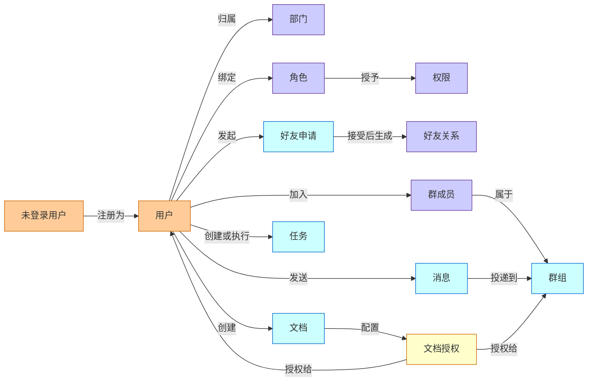
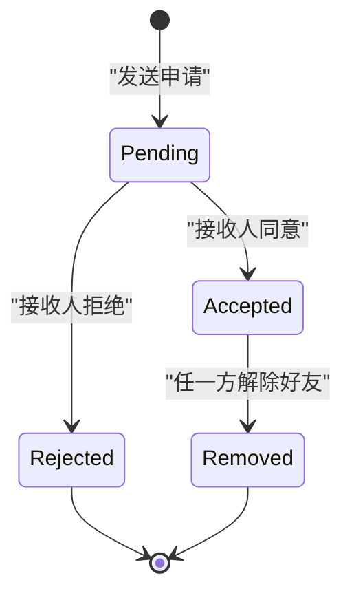
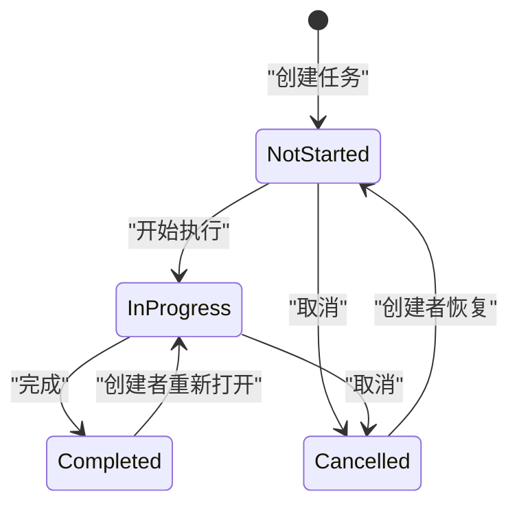
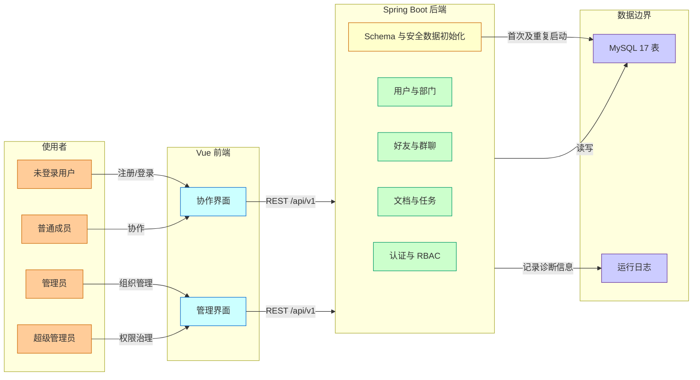
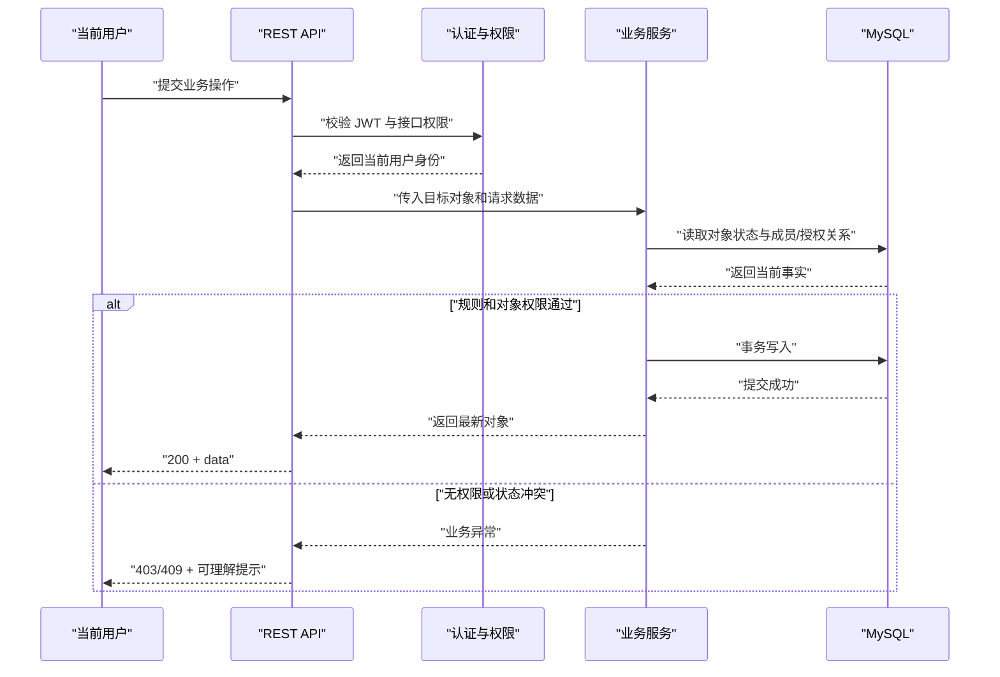

# SkyLink 当前需求规格说明书（缩减交付版）

> 文档版本：v2.0
>
> 更新时间：2026-07-14
>
> 需求基线：`docs/api.md` v1.0、`docs/spec.md` 原始需求、当前 17 表数据边界
>
> 文档定位：本文件是当前开发与验收基线；`docs/spec.md` 保留为最初的完整产品愿景。

## 1. 需求反思与第一性原理解释

| 维度 | 结论 |
| --- | --- |
| 用户提出的表层需求 | 在有限时间内交付一个团队协作办公平台，并明确哪些原需求已缩减。 |
| 可见问题 | 原 `spec.md` 同时包含聊天、文件、日程、公告、日志和统计，范围超过当前 API 与开发周期；如果继续以旧文档验收，会把主动删减误判为缺陷。 |
| 第一性问题 | 团队需要的不是功能数量，而是一条可闭环的最小协作路径：成员能进入系统、找到协作对象、沟通、共享文字内容并推进任务。 |
| 真实约束 | 开发时间有限；后端采用 Spring Boot + MySQL；前后端通过 REST API 协作；安全、权限和数据一致性不能因缩减而省略。 |
| 被挑战的假设 | “协同办公平台必须一次覆盖文件、日程、公告、统计”“有实体类就必须纳入本期”“即时通讯必须在本期实现 WebSocket”。这些都不是完成最小协作闭环的必要条件。 |
| 备选路径 A | 保留全部模块但每个只做浅层 CRUD。问题是验收面过大，跨模块权限和异常路径无法闭环。 |
| 备选路径 B | 只做聊天。问题是缺少组织、权限、文档和任务承接，无法支撑团队协作。 |
| 选择结论 | 本期聚焦身份与组织、关系与群组、REST 消息、Markdown 文档及授权、任务推进、RBAC 管理。文件中心、日程、系统公告、业务审计查询和统计延后。 |

本次缩减采用“完整纵向闭环”而不是“平均砍薄所有模块”。保留下来的模块必须具备权限、校验、异常反馈和可测试接口；被移出的模块不因仓库中仍有页面或实体而恢复为本期需求。

## 2. 背景、当前流程与问题定义

### 2.1 背景

SkyLink 面向企业小团队、校园组织和项目小组，目标是在一个轻量系统中完成成员管理与日常协作。原始方案覆盖九类业务，当前开发周期不足以保证所有模块达到可验收质量，因此需要建立与现有 API 一致的新需求基线。

### 2.2 当前协作流程

1. 管理员维护用户、角色和部门。
2. 成员注册并登录，通过通讯录或好友关系找到协作对象。
3. 成员建立单聊或群聊，发送消息并查看历史记录。
4. 成员创建 Markdown 文档，通过用户或群组授权共享内容。
5. 管理员在本部门内创建并分配任务，负责人更新任务状态。

### 2.3 根因与影响

| 问题 | 根因 | 受影响角色 | 影响 |
| --- | --- | --- | --- |
| 需求、API、表结构范围不一致 | 原需求未随工期缩减更新 | 开发、测试、评审人 | 无法判断缺失功能是缺陷还是有意删减 |
| 部分接口写有“可选”但未定义优先级 | API 文档兼顾远期设想 | 前后端开发 | 容易在刷新令牌、系统配置等能力上产生错误依赖 |
| 旧需求包含无当前数据闭环的能力 | 文件、日程、公告、日志和统计被延后 | 产品、测试 | 验收用例无法落到当前接口和数据表 |

### 2.4 当前范围边界

本需求只约束当前 P0 交付。以下模块属于原始愿景，但不属于本期验收：独立文件中心、任务附件、文件消息上传、日程与提醒、系统公告与通知中心、业务日志查询、数据统计看板。群公告是群组属性，不等同于被移除的系统公告模块。

## 3. 目标、非目标与成功指标

### 3.1 产品目标

- 建立从注册登录到组织协作的身份与权限基础。
- 让成员完成“找到人 -> 建立关系/群组 -> 发送消息”的沟通闭环。
- 让成员完成“创建文档 -> 授权 -> 查看/编辑”的内容协作闭环。
- 让管理员与成员完成“创建任务 -> 分配 -> 更新状态 -> 查询进度”的工作闭环。
- 让 API、数据表和验收用例对本期范围形成同一口径。

### 3.2 非目标

| 非目标 | 本期不做原因 | 后续触发条件 |
| --- | --- | --- |
| 文件上传、下载、分享、收藏 | 需要对象存储、访问控制和清理策略 | 文档与消息闭环稳定后进入 P1 |
| 日程、重复提醒、会议 | 需要时区、重复规则和通知机制 | 明确提醒渠道后进入 P2 |
| 系统公告与通知中心 | 需要发布范围、已读状态和触达机制 | 形成组织级信息触达需求后进入 P2 |
| 可检索业务审计与统计看板 | 需要完整事件口径和聚合链路 | 核心行为稳定、指标定义完成后进入 P2 |
| WebSocket 实时推送、在线状态 | 当前 API 只定义 REST | REST 消息链路通过验收后进入 P1 |
| 游客介绍页 | 不影响业务闭环 | 有展示或运营需求时再设计 |

### 3.3 成功指标

| 指标 | P0 目标 | 验证方式 |
| --- | --- | --- |
| 核心业务闭环 | 认证、沟通、文档、任务四条主路径均可完成 | 端到端测试 |
| 权限越权 | 未授权访问必须返回 401/403，不泄露受保护数据 | 权限矩阵测试 |
| 普通查询响应 | 测试环境下 P95 不超过 1 秒 | 接口压测 |
| 登录响应 | 测试环境下 P95 不超过 2 秒 | 接口压测 |
| 并发目标 | 支持 100 名用户并发执行常用查询与写入 | 基础并发测试 |
| 数据初始化 | 新数据库首次启动自动创建 17 张当前数据表，重复启动不丢数据 | MySQL 初始化测试 |

## 4. 用户角色与利益相关方

| 角色 | 责任与动机 | 权限边界 | 数据范围 | 成功信号 |
| --- | --- | --- | --- | --- |
| 未登录用户 | 注册或登录进入系统 | 只能访问公开认证接口 | 自己提交的注册信息 | 成功获得账号或 Token |
| 普通成员 | 沟通、维护文档、执行任务 | 不得管理全局用户、角色和部门 | 自己、好友、所在群、获授权文档、参与任务 | 能完成日常协作闭环 |
| 管理员 | 管理成员与部门、创建任务 | 不得授予自己超级管理员能力；高权限操作受 RBAC 限制 | 组织内用户与部门 | 组织数据可维护且无越权 |
| 超级管理员 | 管理系统角色、权限和关键账号 | 通过显式引导创建；不得依赖默认密码 | 全局业务数据 | 权限体系可控、账号可治理 |
| 群主/群管理员 | 维护单个群组和成员 | 仅作用于所属群；群管理员不能处置群主 | 指定群组 | 群组成员与资料可正确维护 |
| 任务创建者/执行人 | 分别负责定义任务与推进状态 | 创建者维护任务内容，执行人更新进度 | 参与的任务 | 任务状态真实、可追踪 |
| 开发与测试人员 | 按统一基线实现和验收 | 不定义业务范围 | 文档、接口、测试环境 | 不再因旧实体或旧页面产生范围争议 |

“群主、群管理员、任务创建者、执行人”是对象级身份，不新增全局角色。

## 5. 使用场景与用户故事

### 5.1 核心场景

| 场景类型 | 场景 | 预期闭环 |
| --- | --- | --- |
| 正常路径 | 新成员注册、登录并查看个人资料 | 注册自动获得普通用户角色；登录返回 JWT；可访问本人信息 |
| 正常路径 | 成员发送好友申请并由对方接受 | 申请状态变为已接受；双方好友列表出现对方 |
| 正常路径 | 群主创建群、邀请成员并发送群消息 | 成员关系建立；成员可读写该群消息 |
| 正常路径 | 文档创建者向用户或群组授权 | 被授权成员按权限读取或编辑文档 |
| 正常路径 | 管理员创建任务，执行人更新为进行中和已完成 | 任务列表和详情返回一致状态 |
| 异常路径 | 重复注册用户名、邮箱或手机号 | 返回 409；不创建半成品用户或角色关系 |
| 异常路径 | 非群成员读取群消息 | 返回 403；不返回消息摘要或成员信息 |
| 权限受限路径 | 普通成员调用角色管理接口 | 返回 403；前端隐藏或禁用管理入口 |
| 恢复路径 | 首次启动时角色权限尚未初始化 | 初始化先完成；若基础角色缺失，注册事务回滚并输出可定位错误 |
| 恢复路径 | 文档授权对象已被删除或禁用 | 拒绝新增授权；已有访问按有效用户和群成员状态重新判断 |

### 5.2 用户故事

| 角色 | 行动 | 用户价值 | 验收信号 |
| --- | --- | --- | --- |
| 未登录用户 | 使用用户名、邮箱、手机号和密码注册 | 获得安全账号 | 唯一性与密码规则通过，自动绑定 `ROLE_USER` |
| 普通成员 | 搜索和查看必要的成员公开资料 | 找到协作对象且不泄露隐私 | 公开资料不包含密码、手机号等敏感字段 |
| 普通成员 | 管理好友申请 | 建立双向联系人关系 | 只有接收人能处理待处理申请，处理不可重复 |
| 群主 | 邀请、移除成员并设置群管理员 | 维护稳定的群协作空间 | 对象级权限正确，群主不能退出后留下无主群 |
| 普通成员 | 查看会话和历史消息并撤回本人短时消息 | 延续沟通上下文 | 单聊/群聊目标二选一，撤回受发送人和时间限制 |
| 文档创建者 | 按用户或群组授予文档权限 | 低成本共享团队知识 | 授权幂等，移除后立即失去对应能力 |
| 任务执行人 | 更新本人负责任务的状态 | 反馈工作进度 | 只能执行允许的状态迁移，列表与详情一致 |
| 超级管理员 | 管理角色、权限和用户角色 | 控制系统能力边界 | 权限变更后新请求立即按新权限判定 |

## 6. 概念与术语表

| 概念 | 定义与边界 | 所有者/事实来源 | 生命周期作用 |
| --- | --- | --- | --- |
| 用户 | 可认证的个人账号；逻辑删除后不可登录 | `user` | 注册、启禁用、逻辑删除 |
| 部门 | 用户的组织归属；当前只支持单部门归属 | `department` + `user.department_id` | 创建、修改、空部门删除 |
| 角色 | 全局权限集合的命名载体 | `role` | 创建、启停、删除 |
| 权限 | 受保护接口或操作的稳定编码 | `permission` | 初始化、分配、撤销 |
| 好友申请 | 建立好友关系前的单向请求 | `friend_request` | 待处理、已接受、已拒绝 |
| 好友关系 | 两名用户之间唯一、对称的关系 | `friendship` | 建立、解除 |
| 群组 | 有群主、成员和群公告的协作空间 | `chat_group` | 正常、停用/逻辑删除 |
| 群成员 | 用户在群组中的对象级角色 | `group_member` | 群主、管理员、成员、退出 |
| 消息 | 单聊或群聊中的一条内容记录 | `message` | 正常、已撤回 |
| 文档 | Markdown 内容及其可见范围 | `document` | 私有、部门可见、归档、逻辑删除 |
| 文档权限 | 用户或群组对文档的访问级别 | `document_permission`、`document_group_permission` | 设置、覆盖、移除 |
| 文档收藏 | 原需求保留的数据能力，本期无 API | `document_favorite` | P1 候选，不进入 P0 验收 |
| 任务 | 有创建者、执行人、优先级和期限的工作项 | `task` | 未开始、进行中、已完成、已取消 |
| 系统配置 | 预留键值配置 | `system_config` | P1 候选，本期不开放管理接口 |

## 7. 领域模型、实体字段与生命周期

### 7.1 核心概念关系

Diagram Quick Read:
- 该图回答本期有哪些核心业务对象以及它们如何形成协作闭环。
- 用户是组织、关系、群组、消息、文档和任务的共同主体。
- 全局 RBAC 决定接口能力，对象级成员/授权关系决定具体数据范围。
- `user`、`group`、`document` 和 `task` 相关表分别是各自事实来源。

### 7.2 当前 17 表数据边界

| 领域 | 表 | P0 用途 |
| --- | --- | --- |
| 身份组织 | `user`、`department` | 账号、个人资料、启禁用、部门归属 |
| RBAC | `role`、`permission`、`user_role`、`role_permission` | 全局角色权限 |
| 好友 | `friend_request`、`friendship` | 好友申请与双向关系 |
| 群聊 | `chat_group`、`group_member`、`message` | 群组、成员、单聊/群聊消息 |
| 文档 | `document`、`document_permission`、`document_group_permission` | 文档与用户/群组授权 |
| 工作 | `task` | 任务分配与状态 |
| 预留 | `document_favorite`、`system_config` | 表可创建，但无 P0 API 与验收要求 |

当前 schema 不创建文件、日程、系统通知、任务附件和业务审计相关表。仓库中对应实体是缩减后保留代码，不构成本期需求。

### 7.3 关键生命周期

Diagram Quick Read:
- 好友申请只有接收人能从待处理状态做出一次决定。
- 接受后生成唯一对称好友关系；解除关系不回写历史申请。
- 重复待处理申请、自加好友和已建立好友关系必须被拒绝。

Diagram Quick Read:
- 执行人可推进未开始、进行中和已完成状态。
- 取消、恢复和重新打开改变管理承诺，只允许创建者或管理员执行。
- 状态更新必须使用服务端当前状态校验，拒绝不合法跳转。

## 8. 产品定位与系统边界

SkyLink P0 是单组织、轻量、前后端分离的协作系统，不是企业级即时通讯基础设施、文件平台或工作流引擎。

Diagram Quick Read:
- 前端只通过 `/api/v1` 使用后端，MySQL 是业务事实来源。
- P0 不依赖对象存储、消息队列、第三方通知或 WebSocket 服务。
- schema 初始化和安全数据初始化属于部署控制面，不是用户功能。
- 运行日志用于排障；本期不提供可查询的业务审计产品模块。

## 9. 产品方案与架构

### 9.1 最小充分方案

系统采用“全局权限 + 对象关系”两层授权：RBAC 判断用户是否可以调用某类接口；好友关系、群成员、文档授权和任务参与关系进一步限制用户可以操作哪些对象。相比为每个业务对象创建独立角色，这一方案概念更少，并能覆盖当前协作路径。

### 9.2 分层职责

| 层 | 职责 | 不承担 |
| --- | --- | --- |
| 前端交互层 | 表单校验、列表/详情展示、无权限与错误反馈 | 不作为权限事实来源 |
| API 与认证层 | 统一响应、JWT 校验、接口权限 | 不直接拼装跨域持久化逻辑 |
| 业务服务层 | 事务、对象级授权、状态迁移、幂等规则 | 不信任前端传入的身份字段 |
| 数据访问层 | MyBatis-Plus 查询与写入、逻辑删除 | 不决定业务权限 |
| 初始化层 | 创建表、基础角色权限、可选超级管理员 | 不覆盖已有业务数据 |

### 9.3 核心写入流程

Diagram Quick Read:
- JWT 只证明当前身份，业务服务仍需读取对象关系后再授权。
- 写入以服务端当前状态为准，并在同一事务内完成校验与变更。
- 权限失败和状态冲突不产生部分数据。

## 10. 关键交互规则与决策逻辑

| 决策点 | 确定性规则 | 失败反馈 | 恢复方式 |
| --- | --- | --- | --- |
| 注册唯一性 | 用户名、邮箱、手机号分别唯一；任一冲突即整体失败 | 409，指出冲突字段但不泄露其他账号详情 | 修改字段后重试 |
| 登录 | 支持用户名或邮箱；禁用、删除用户不得登录 | 401 或明确的账号禁用提示 | 联系管理员或修正凭据 |
| 部门删除 | 仅管理员操作，且部门成员数为 0 | 409，提示先迁移成员 | 迁移成员后重试 |
| 好友申请 | 不能向自己申请；不能对现有好友或已有待处理关系重复申请 | 409 | 查看现有申请/好友关系 |
| 群操作 | 群主可管理全部成员；群管理员可邀请/移除普通成员；普通成员只能退出 | 403 | 联系群主或管理员 |
| 消息目标 | `receiverId` 与 `groupId` 必须且只能填写一个 | 400 | 修正目标后重发 |
| 消息撤回 | 只能撤回本人发送且不超过 2 分钟的消息 | 403/409 | 消息保留，不提供强制删除 |
| 文档访问 | 创建者/管理员或有效用户授权、有效群授权可访问；取最高有效权限 | 403 | 请求创建者授权 |
| 文档权限 | P0 开放 `read`、`edit`、`manage`；`comment` 因无评论能力暂不在 UI 提供 | 400/禁用选项 | 选择受支持权限 |
| 任务状态 | 执行人推进工作状态；创建者/管理员可取消、恢复、重新打开 | 403/409 | 刷新详情后按允许操作重试 |
| 高风险操作 | 删除用户、解散群、删除文档/任务必须展示对象身份和影响 | 二次确认后仍失败则保留原状态 | 刷新对象或联系有权限角色 |

所有列表都必须有加载、空数据、错误和无权限状态。前端隐藏无权限入口只是体验优化，后端必须独立执行相同权限判断。

## 11. 详细模块设计

### 11.1 认证与个人中心（P0）

| 项目 | 要求 |
| --- | --- |
| 入口 | 注册页、登录页、个人中心 |
| 表单字段 | 注册：用户名、密码、昵称、邮箱、手机号；登录：账号、密码；资料：昵称、头像地址、邮箱、手机号；改密：旧密码、新密码 |
| 操作 | 注册、登录、查看/更新本人资料、修改密码 |
| 校验 | 密码至少 8 位且含字母和数字；用户名/邮箱/手机号唯一；资料更新不能覆盖其他用户唯一字段 |
| 状态 | 未认证、已认证、账号禁用、账号逻辑删除、Token 过期 |
| 禁用与错误 | 提交中按钮禁用；字段错误就地展示；认证失败不区分“账号不存在”和“密码错误” |
| 安全记录 | 登录失败、密码修改、账号禁用写入运行日志；不记录明文密码和完整 Token |
| 验收 | `/auth/register`、`/auth/login`、`/users/me`、`/users/me/password` 主路径和异常路径通过 |

刷新 Token 与服务端 Token 黑名单未纳入 P0；当前实现支持 `/auth/refresh` 通过 HttpOnly Cookie 中的 Refresh Token 轮换 Access Token，响应体不得返回 Refresh Token。`/auth/logout` 清除 Refresh Token Cookie，不提供服务端 Token 黑名单能力。

### 11.2 用户、部门与 RBAC（P0）

| 页面/接口面 | 列表与详情字段 | 操作 | 规则与状态 |
| --- | --- | --- | --- |
| 用户列表/详情 | 用户 ID、用户名、昵称、头像、部门、状态、角色；公开详情隐藏手机号等敏感字段 | 查询、筛选、启禁用、超级管理员逻辑删除 | 普通成员无管理入口；删除本人和最后可用超级管理员应被阻止 |
| 部门列表/表单 | 部门名、负责人、描述、成员数 | 创建、更新、删除、查看成员、加入成员、移出成员 | 名称唯一；非空部门不可删除；负责人必须是有效用户；加入成员会迁移用户部门归属 |
| 角色列表/表单 | 角色名、角色编码、描述、状态 | 创建、更新、删除、分配权限 | 角色编码唯一；系统基础角色不得被破坏性删除 |
| 权限列表 | 权限名、编码、类型、父级、排序 | 查看、为角色设置权限 | 权限编码是后端鉴权事实，不允许客户端自定义任意接口权限 |
| 用户角色 | 用户、角色列表 | 分配、移除 | 不允许通过普通管理员接口授予 `ROLE_SUPER_ADMIN` |

列表无数据时展示空状态；接口 403 时不展示残留管理数据；并发修改冲突返回 409，用户刷新后再操作。

### 11.3 好友与通讯录（P0）

| 项目 | 要求 |
| --- | --- |
| 入口 | 通讯录、好友列表、好友申请列表、用户公开资料 |
| 列表字段 | 用户昵称、头像、部门；好友增加时间；申请人、附言、申请时间、状态 |
| 操作 | 发送申请、接受/拒绝、查看好友、搜索昵称、解除好友 |
| 校验 | 禁止自加、重复待处理申请和重复好友；只有接收人处理申请 |
| 状态 | 申请待处理/接受/拒绝；关系存在/解除 |
| 异常与恢复 | 对方禁用或删除时不能新建关系；并发处理同一申请时仅第一次成功 |
| 验收 | 五组 `/friends` 接口覆盖主路径、重复操作、越权处理和分页 |

### 11.4 群组（P0）

| 项目 | 要求 |
| --- | --- |
| 入口 | 我的群组、群详情、成员管理、群资料编辑 |
| 列表/详情字段 | 群 ID、名称、头像、公告、群主、成员数、状态、创建时间；成员昵称、头像、对象级角色、加入时间 |
| 表单字段 | 群名、头像地址、初始成员；更新时支持群名、头像、公告 |
| 操作 | 创建、查看、更新、解散、邀请、移除成员、设置/取消管理员、退出 |
| 校验 | 群名必填；邀请用户必须有效且非现有成员；群主不能被移除或直接退出；设置管理员仅限群主 |
| 空/错误/无权限 | 无群组时提供创建入口；非成员访问返回 403；成员变更冲突返回 409 |
| 记录 | 解散、踢人和角色变更写运行日志，包含操作者与目标 ID |
| 验收 | `/groups` 十组接口覆盖群主、管理员、普通成员三种对象身份 |

`docs/api.md` 的群更新示例尚未包含 `notice`，应在接口契约同步时补充该可选字段。

### 11.5 消息（P0）

| 项目 | 要求 |
| --- | --- |
| 入口 | 会话列表、单聊页、群聊页 |
| 列表/详情字段 | 会话类型、目标 ID/名称/头像、最后消息、最后时间；消息发送人、类型、内容、发送时间、撤回状态 |
| 操作 | 发送、查看会话、分页/游标加载历史、撤回 |
| 校验 | 单聊目标和群目标二选一；单聊需为有效用户，群聊需为有效群成员；内容非空且限制长度 |
| 类型 | P0 保证 `text`、`emoji`；`system` 由服务端产生；`image` 因无文件上传链路不纳入 P0 上传验收 |
| 状态 | 正常、已撤回；撤回后仅显示占位信息，不返回原内容 |
| 空/错误/无权限 | 无会话显示空状态；历史加载失败可重试；非群成员或无权单聊返回 403 |
| 验收 | `/messages` 四组接口覆盖单聊、群聊、分页、越权和 2 分钟撤回窗口 |

P0 采用 REST 拉取，不承诺在线状态、已读回执、未读计数和实时推送。

### 11.6 在线文档（P0）

| 项目 | 要求 |
| --- | --- |
| 入口 | 文档列表、文档详情/编辑、权限管理 |
| 列表字段 | 标题、创建者、状态、更新时间；列表不返回完整正文 |
| 详情/表单字段 | 标题、Markdown 内容、状态、创建者、创建/更新时间 |
| 操作 | 创建、查看、更新、逻辑删除；设置/移除用户权限和群组权限；申请文档级协同票据；多人实时编辑 |
| 校验 | 标题必填；正文长度受数据库字段限制；授权对象必须有效；同一对象授权使用覆盖式幂等更新 |
| 权限 | 创建者默认 `manage`；`read` 可查看，`edit` 可修改，`manage` 可授权和删除；多条授权取最高权限 |
| 状态 | 私有、部门可见、归档、逻辑删除；部门可见表示创建者所在部门可读；归档文档默认只读，创建者/管理员可恢复编辑状态 |
| 空/错误/无权限 | 无文档显示创建入口；403 不返回标题和正文；授权对象失效时显示可移除记录 |
| 验收 | `/documents` 接口覆盖直接授权、群授权、撤权、逻辑删除、协同票据与越权；两客户端最终一致，只读客户端的伪造更新被服务端拒绝 |

文档收藏表为后续能力，因 `docs/api.md` 没有对应接口，不进入 P0 页面和验收。

### 11.7 任务（P0）

| 项目 | 要求 |
| --- | --- |
| 入口 | 我的任务列表、任务详情、创建/编辑表单 |
| 列表字段 | 标题、执行人、优先级、状态、截止时间、更新时间 |
| 详情/表单字段 | 标题、内容、创建者、执行人、优先级、状态、截止时间；备注和开始时间不作为 P0 必填合同 |
| 操作 | 管理员创建；创建者/管理员更新与删除；执行人/管理员更新工作状态 |
| 校验 | 标题必填；执行人必填且必须与创建者属于同一有效部门；优先级为 1/2/3；截止时间格式合法；状态迁移符合 7.3 |
| 数据范围 | 普通成员只看自己创建或执行的任务；管理员可按执行人筛选组织任务；创建或改派执行人时只能选择任务创建者所在部门成员 |
| 空/错误/无权限 | 无任务提供筛选清空或创建入口；并发状态冲突返回 409；无权详情返回 403/404 |
| 验收 | `/tasks` 六组接口覆盖创建、筛选、详情、编辑、状态迁移、逻辑删除 |

本期没有“项目”实体，因此 API 文档中的“项目负责人”不定义为独立系统角色；任务创建权限以管理员或明确的权限编码为准。

## 12. 权限、数据范围与角色矩阵

| 角色/对象身份 | 操作 | 对象范围 | 数据范围 | 审批 | 无权限表现 | 记录要求 |
| --- | --- | --- | --- | --- | --- | --- |
| 未登录用户 | 注册、登录 | 无业务对象 | 本次请求 | 无 | 其他接口 401 | 认证失败写运行日志 |
| 普通成员 | 查看/修改本人资料 | 本人 | 本人完整资料 | 无 | 他人敏感字段不可见 | 改密写运行日志 |
| 普通成员 | 好友管理 | 自己发出/收到的申请与关系 | 本人关系网 | 对方接受即成立 | 非参与申请 403 | 关系变更记录操作者 ID |
| 群成员 | 读写群消息 | 所在有效群 | 群内消息 | 无 | 非成员 403 | 撤回记录消息 ID |
| 群管理员 | 邀请/移除普通成员 | 被授权群 | 群成员 | 无 | 群主和其他管理员受保护 | 记录成员前后角色 |
| 群主 | 群资料、管理员、解散 | 自己拥有的群 | 全群 | 高风险操作二次确认 | 其他群 403 | 记录目标群和成员 |
| 文档读者 | 查看文档 | 有效授权文档 | 标题与正文 | 无 | 403 且不泄露内容 | 无强制业务审计 |
| 文档编辑者 | 编辑文档 | 有 `edit/manage` 的文档 | 文档内容 | 无 | 只读态禁用保存 | 运行日志记录文档 ID |
| 文档管理者 | 授权、删除 | 自建或 `manage` 文档 | 文档与授权 | 删除需确认 | 无 manage 权限 403 | 记录授权变更 |
| 任务执行人 | 查看、推进状态 | 自己负责的任务 | 任务详情 | 无 | 非参与任务 403/404 | 记录状态前后值 |
| 管理员 | 用户状态、部门、任务 | 组织范围 | 组织业务数据 | 高风险操作确认 | 超管专属操作 403 | 记录操作者和目标 |
| 超级管理员 | 角色、权限、用户角色 | 全局 | 全局 | 高风险操作确认 | 仍受基础角色保护规则约束 | 记录权限前后值 |

P0 不建设审批流。表中的“确认”是防误操作交互，不产生审批单。

## 13. 审计、通知、依赖与恢复

### 13.1 记录与通知

- P0 不提供业务审计表和日志查询页面。
- 登录失败、改密、用户启禁用、角色权限变更、群成员变更、文档授权、任务状态变更等关键动作必须输出结构化运行日志。
- 日志不得包含密码、JWT、完整文档正文或私聊正文。
- P0 不提供站内通知中心；好友申请、群成员变化和任务变化通过对应列表刷新感知。

### 13.2 依赖与一致性

| 依赖 | 读写所有者 | 失败表现 | 一致性与恢复 |
| --- | --- | --- | --- |
| MySQL 8.x | 后端服务 | 启动失败或请求 500 | 建表失败阻断启动；业务写入使用事务；数据库恢复后重试 |
| `schema.sql` | 部署初始化 | 表缺失或约束错误 | `CREATE TABLE IF NOT EXISTS` 可重复执行，不删除已有数据；`user.department_id` 与 `department.leader_id` 由服务层校验，避免循环外键初始化失败 |
| 安全基础数据 | `SecurityDataInitializer` | 注册无法绑定角色、鉴权异常 | 初始化幂等；缺少基础角色时注册回滚 |
| JWT 密钥 | 部署环境 | 应用拒绝启动或令牌无效 | 使用至少 32 字节随机密钥；轮换时要求重新登录 |
| 前端 REST 客户端 | Vue 应用 | 页面加载/提交失败 | 显示可重试错误；不得把演示数据当作真实写入成功 |

### 13.3 回滚与恢复

- 逻辑删除适用于用户、群组、文档和任务等有历史关系的核心对象；P0 不提供批量物理删除。
- 事务型操作失败时不得保留半成品关系，例如接受好友申请但未创建好友关系、创建用户但未绑定普通角色。
- 幂等设置类接口重复提交应返回当前结果，不重复插入授权或角色关系。
- 网络超时后，前端先重新获取对象状态，再决定是否重试写入，避免重复操作。

## 14. 里程碑、范围、风险与发布

### 14.1 优先级与里程碑

| 阶段 | 范围 | 进入理由 | 完成条件 |
| --- | --- | --- | --- |
| P0-1 基础 | schema 自动初始化、安全数据、认证、用户、部门、RBAC | 所有业务的前置依赖 | 新库可启动；注册登录和权限拒绝可测 |
| P0-2 沟通 | 好友、群组、REST 消息 | 形成团队沟通闭环 | 单聊/群聊主路径和对象权限通过 |
| P0-3 协作 | 文档授权、任务状态 | 形成内容与工作闭环 | 授权撤销、任务迁移、越权用例通过 |
| P1 增强 | 消息 WebSocket/未读、文档收藏、协同多实例、历史版本、系统配置、图片/文件消息链路 | 提升体验或扩展容量但不阻断核心闭环 | 独立 PRD 与数据迁移方案通过评审 |
| P2 扩展 | 文件中心、日程、系统公告、业务审计、统计 | 原完整愿景 | 按模块重新确认需求，不直接以保留实体开工 |

### 14.2 主要风险

| 风险 | 影响 | 缓解措施 |
| --- | --- | --- |
| API 文档中的可选能力被前端依赖 | 联调阻塞 | 以本文件 P0 为准，刷新令牌与系统配置明确延后 |
| 群公告、图片消息、评论权限存在合同歧义 | 前后端行为不一致 | 按本文件规则修订 API 示例与枚举 |
| 全局角色与对象角色混用 | 越权 | 业务服务统一执行对象级授权测试 |
| 逻辑删除数据与唯一键冲突 | 初始化或重新创建失败 | 为基础数据采用可恢复/显式处理策略，并增加重启测试 |
| REST 消息被误认为实时推送 | 体验预期不一致 | UI 标明刷新机制，WebSocket 单独进入 P1 |

### 14.3 发布策略

1. 在空 MySQL 数据库验证首次启动、17 表创建和安全基础数据初始化。
2. 在已有数据数据库验证重复启动不删除表和数据。
3. 先开放超级管理员引导，创建后关闭引导开关并移除密码环境变量。
4. 按 P0-1、P0-2、P0-3 顺序联调；每阶段通过权限与异常用例后再进入下一阶段。

## 15. 验收标准与 QA 验证

### 15.1 功能与权限验收

| ID | 验收场景 | 前置条件 | 操作 | 预期结果 |
| --- | --- | --- | --- | --- |
| AC-01 | 首次自动建表 | 已创建空数据库 | 启动后端 | 自动创建明确的 17 张表，启动成功 |
| AC-02 | 重复启动 | 已有表和业务数据 | 再次启动后端 | 不执行 `DROP TABLE`，已有数据保持不变 |
| AC-03 | 安全注册 | 基础角色已初始化 | 提交合法注册信息 | 密码 BCrypt 存储，用户与 `ROLE_USER` 同事务创建 |
| AC-04 | 注册冲突回滚 | 邮箱已存在 | 提交重复邮箱 | 返回 409，不产生新用户或角色关系 |
| AC-05 | JWT 保护 | 未携带或携带无效 Token | 请求受保护接口 | 返回 401，不返回业务数据 |
| AC-06 | 管理权限 | 普通成员已登录 | 请求用户状态或角色管理接口 | 返回 403，无数据变更 |
| AC-07 | 部门删除约束 | 部门内存在成员 | 管理员删除部门 | 返回 409，部门和成员归属不变 |
| AC-08 | 好友申请幂等 | 已有待处理申请 | 再次发起相同方向申请 | 返回 409，不新增重复申请 |
| AC-09 | 好友接受事务 | 接收人有待处理申请 | 接受申请 | 状态更新并生成唯一好友关系，任一步失败则整体回滚 |
| AC-10 | 群对象权限 | 普通群成员已登录 | 设置管理员或踢出成员 | 返回 403，无成员变更 |
| AC-11 | 群消息隔离 | 用户不在目标群 | 查询或发送群消息 | 返回 403，不泄露群消息 |
| AC-12 | 消息目标校验 | 已登录 | 同时提交 `receiverId` 和 `groupId` | 返回 400，不创建消息 |
| AC-13 | 消息撤回 | 消息由其他用户发送或超过 2 分钟 | 请求撤回 | 返回 403/409，原状态不变 |
| AC-14 | 文档直接授权 | 创建者与目标用户有效 | 授予 `edit` 后目标用户更新文档 | 更新成功；撤权后同操作返回 403 |
| AC-15 | 文档群授权 | 目标用户是获授权群成员 | 读取文档 | 返回正文；退出群后重新请求返回 403 |
| AC-16 | 文档信息防泄漏 | 无权用户已登录 | 请求文档详情 | 返回 403/404，响应不包含标题和正文 |
| AC-17 | 任务数据范围 | 普通成员不参与目标任务 | 请求任务详情 | 返回 403/404，不泄露任务内容 |
| AC-18 | 任务同部门指派 | 任务创建者已归属部门 | 给其他部门用户创建或改派任务 | 返回 400，任务创建/更新失败且原执行人不变 |
| AC-19 | 任务状态迁移 | 执行人负责未开始任务 | 更新为进行中、再更新为已完成 | 两次迁移成功；列表与详情状态一致 |
| AC-20 | 并发冲突 | 两个请求同时处理同一申请/状态 | 并发提交 | 仅一个请求成功，另一个返回 409 或当前结果 |
| AC-21 | 敏感日志检查 | 执行登录、改密和文档编辑 | 检查运行日志 | 不出现密码、完整 Token、私聊正文和文档正文 |

### 15.2 非功能验收

| 类别 | 验收标准 |
| --- | --- |
| 性能 | 测试数据量和硬件基线固定后，登录 P95 <= 2 秒，普通查询 P95 <= 1 秒，100 并发无明显错误率上升 |
| 安全 | 密码 BCrypt；JWT 密钥无默认值且至少 32 字节；所有受保护接口覆盖 401/403 用例；参数使用绑定查询防 SQL 注入 |
| 可用性 | 所有 P0 列表具备加载、空、错误、无权限状态；高风险操作展示目标与影响；失败后给出重试或修正路径 |
| 一致性 | 用户注册与角色绑定、好友接受、群创建与成员关系等多表写入均使用事务 |
| 可维护性 | 统一响应和异常映射；API、当前需求、模型和 schema 的 P0 范围一致；行为变更同步测试 |

### 15.3 合同待同步项

本文件批准后，应在后续文档维护中同步以下接口合同，但不因此扩大 P0：

1. 在群组更新请求中补充可选 `notice` 字段。
2. 明确 P0 不依赖 `/auth/refresh`、`/auth/logout` 的服务端黑名单能力。
3. 暂不向 UI 暴露文档 `comment` 权限，直到评论接口存在。
4. 明确图片消息不包含本期文件上传链路。
5. 将任务创建权限中的“项目负责人”替换为可执行的 RBAC 权限编码。
